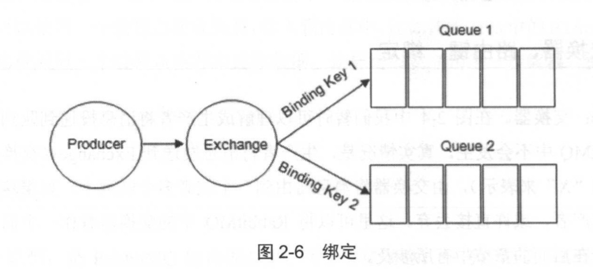

# RabbitMQ

RabbitMQ 是一款消息中间件，具有高可靠、易扩展、高可用及丰富的功能特性。整体上是一个生产者与消费者模型，主要负责接收、存储和转发消息。生产者创建消息，然后发布到 RabbitMQ 中，RabbitMQ 之后会根据标签把消息发送给感兴趣的消费者（Consumer）。

**消息：**消息由消息体（payload）和标签 (Label）组成。

**消息体：**一般是一个带有业务逻辑结构的数据，比如一个 JSON 字符串。当然可以进一步对这个消息体进行序列化操作

**消息的标签：**用来表述这条消息，比如一个交换器的名称和一个路由键

#### **消息中间件的两种传递模式：**

- 点对点
  - 点对点模式是基于队列的，消息生产者发送消息到队列，消息消费者从队列中接收消息，队列的存在使得消息的异步传输成为可能。 
- 发布订阅
  - 发布订阅模式定义了如何向一个内容节点发布和订阅消息，这个内容节点称为主题（topic），主题可以认为是消息传递的中介，消息发布者将消息发布到某个主题，而消息订阅者则从主题中订阅消息。主题使得消息的订阅者与消息的发布者互相保持独立，不需要进行接触即可保证消 息的传递，发布订阅模式在消息的一对多广播时采用。

#### **消息中间件的作用**

- 解耦
- 冗余〈存储）： 
- 削峰： 
- 扩展性
- 可恢复性： 
- 顺序保证： 
- 异步通信：
- 缓冲： 

#### RabbiyMQ的整体模型架构

**Producer：** 生产者，就是投递消息的一方。

**Consumer：**消费者：就是接收消息的一方。消费者连接到 RabbitMQ 服务器，并订阅到队列上。当消费者消费一条消息时，只是消费消息的消息（payload）。在消息路由的过程中，消息的标签会丢弃，存入到队列中的消息只 有消息体，消费者也只会消费到消息体，也就不知道消息的生产者是谁，当然消费者也不需要 知道。
**Broker**：消息中间件的服务节点。对于 RabbitMQ 来说， 一个 RabbitMQ Broker 可以简单地看作一个 RabbitMQ 服务节点， 或者 RabbitMQ 服务实例。大多数情况下也可以将一个 RabbitMQ Broker 看作一台 RabbitMQ 服务器。

**Queue**：队列，是 RabbitMQ 的内部对象，用于存储消息。

- RabbitMQ 中消息都只能存储在队列中。
- RabbitMQ 不支持队列层面的广播消费

- 多个消费者可以订阅同一个队列，这时队列中的消息会被平均分摊（Round-Robin，即轮询） 给多个消费者进行处理，而不是每个消费者都收到所有的消息井处理

**Exchange**：交换器  可以理解成生产者将消息投递到队列中，

- 生产者将消息发送到 Exchange （交换器，通常也 可以用大写的“X”来表示），由交换器将消息路由到一个或者多个队列中。如果路由不到，或 许会返回给生产者，或许直接丢弃

**RoutingKey**：路由键。生产者将消息发给交换器的时候， 一般会指定一个 RoutingKey，用来指定这个消息的路由规则，而这个 Routing Key 需要与交换器类型和绑定键（BindingKey）联合使用才能最终生效。

**Binding**：绑定。 RabbitMQ 中通过绑定将交换器与队列关联起来，在绑定的时候一般会指定一个绑定键（BindingKey），这样 RabbitMQ 就知道如何正确地将消息路由到队列了，  

#### RabbitMQ 中的交换器有四种类型

- ##### fanout 

  - 它会把所有发送到该交换器的消息路由到所有与该交换器绑定的队列中。

- direct 

  - direct 类型的交换器路由规则也很简单，它会把消息路由到那些 BindingKey 和 RoutingKey 完全匹配的队列中。 

- topic 

- 

- headers

#### RabbitMQ运转流程

**生产者发送消息的过程**

- (1）生产者连接到 RabbitMQ Broker， 建立一个连接（Connection），开启一个信道（Channel) （详细内容请参考 3.1 节〉。 
- (2）生产者声明一个交换器，并设置相关属性，比如交换机类型、是否持久化等（详细内 容请参考 3.2 节〉。 
- (3）生产者声明一个队列井设置相关属性，比如是否排他、是否持久化、是否自动删除等 （详细内容请参考 3.2 节）。
- (4）生产者通过路由键将交换器和队列绑定起来（详细内容请参考 3.2 节）。
-  (5 ）生产者发送消息至 RabbitMQ Broker，其中包含路由键、交换器等信息（详细内容请参 考 3.3 节）。
- (6）相应的交换器根据接收到的路由键查找相匹配的队列。
- (7）如果找到，则将从生产者发送过来的消息存入相应的队列中。
-  (8）如果没有找到，则根据生产者配置的属性选择丢弃还是回退给生产者（详细内容请参 考 4.1 节）。
- (9）关闭信道。
- (10）关闭连接。

**消费者接收消息的过程**

- ( 1)消费者连接到 RabbitMQ Broker，建立一个连接（Connection），开启一个信道（Channel)。
- (2）消费者向 RabbitMQ Broker 请求消费相应队列中的消息，可能会设置相应的回调函数， 以及做一些准备工作（详细内容请参考 3.4 节〉。 
- (3）等待 RabbitMQ Broker 回应并投递相应队列中的消息，消费者接收消息。
- (4)消费者确认（ack）接收到的消息。
- (5) RabbitMQ 从队列中删除相应己经被确认的消息。
- (6）关闭信道。
- (7）关闭连接。