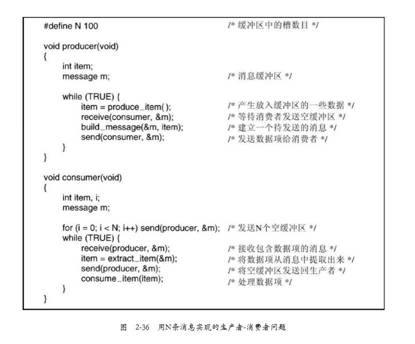

# 消息传递

进程间通信的方法使用两条原语send和 receive，它们像信号量而不像管程，是系统调用而不是语言成分

#### 消息传递系统的设计要点

- **消息有可能被网络丢失。**

​		为了防止消息丢失，发送方和接收方可以达成如下一致：一 旦接收到信息，接收方马上回送一条特殊的确认（acknowledgement）消息。如果发送方在一段时间间隔内未收到确认，则重发消息。

- **消息本身被正确接收，而返回给发送者的确认信息丢失的情况**

​		发送者将重发信息，这样接收者将接收到两次相同的消息。对于接收者来说，如何区分新的消息和一条重发的老消息是非常重要的。通常采用在每条原始消息中嵌入一个连续的序号来解决此问题。如果接收者收到一条消息，它具有与前面某一条消息一样的序号，就知道这条消息是重复的，可以忽略。

- **消息系统还需要解决进程命名的问题，**

​		在send和receive调用中所指定的进程必须是没有二义性的。

- **身份 认证（authentication）也是一个问题。**

​		比如，客户机怎么知道它是在与一个真正的文件服务器通信，而不是与一个冒充者通信？

#### 用消息传递解决生产者-消费者问题

​		假设所有的消息都有同样的大小，并且在尚未接收到发出的消息时，由操作系统自动进行缓冲。 在该解决方案中共使用N条消息，这就类似于一块共享内存缓冲区中的N个槽。消费者首先将N条空消息发送给生产者。当生产者向消费者传递一个数据项时，它取走一条空消息并送回一条填充了内容的消息。通过这种方式，系统中总的消息数保持不变，所以消息都可以存放在事先确定数量的内存中。如果生产者的速度比消费者快，则所有的消息最终都将被填满，等待消费者，生产者将被阻塞，等待返回一条空消息。如果消费者速度快，则情况正好相反：所有的消息均为空，等待生产者来填充它们，消费者被阻塞，以等待一条填充过的消息。

##### 如何对消息进行编址？

- 一种方法是为每个进程分配一个惟 一的地址，让消息按进程的地址编址。
- 另一种方法是引入一种新的数据结构，称作信箱（mailbox）。信箱是一个用来对一定数量的消息进行缓冲的地方，信箱中消息数量的设置方法也有多种，典型的方法是在信箱 创建时确定消息的数量。当使用信箱时，在send和receive调用中的地址参数就是信箱的地址，而不是进程的地址。当一个进程试图向一个满的信箱发消息时，它将被挂起，直到信箱内有消息被取走，从而为新消息腾出空间。

**当使用信箱时，缓冲机制的作用**：目标信箱容纳那些已被发送但尚未被目标进程接收的消息。

##### 会合（rendezvous）

- 使用信箱的另一种极端方法是彻底取消缓冲。采用这种方法时，如果send在receive之前执行，则发送进 程被阻塞，直到receive发生。在执行receive时，消息可以直接从发送者复制到接收者，不用任何中间缓冲。 类似地，如果先执行receive，则接收者会被阻塞，直到send发生。
- 与带有缓冲的消息方案相比，该方案实现起来更容易一些，但却降低了灵活性，因为发送者和接收者一定要
  以步步紧接的方式运行。

**一个著名的消息传递系统是消息传递接口（MessagePassing Interface，MPI）**